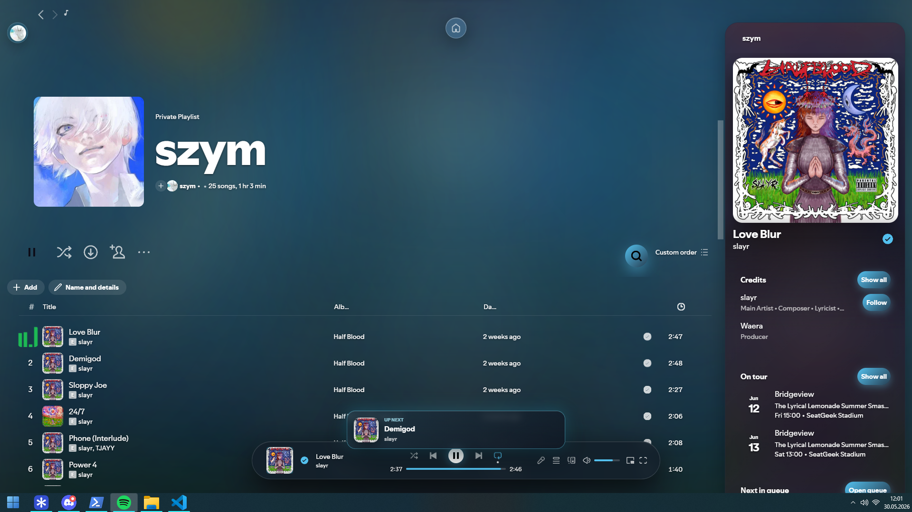

<div align="center">
  <h1>Spotify+ | The Ultimate Experience</h1>
  <p><i>A state-of-the-art Spicetify theme inspired by modern glassmorphism and Apple-style aesthetics.</i></p>

  [](#)
  [](#)
</div>

<br>

Spotify+ transforms your boring Spotify into a luxury feeling app, It offers Ad-Block and many other features for Non-Premium users.

---

## 📸 Preview


---

## ✨ Features

- **Floating Home Cluster**: A sleek, minimal navigation dock that elegantly expands on hover.
- **Centered Search Experience**: A cinematic search bar with ring animations that docks smoothly on scroll.
- **Theme Settings Panel**: Real-time customization for colors, glows, and glass effects—right inside Spotify.
- **Frosted Glass Customization**: Adjustable blur intensity and premium translucent reflections.
- **Atmospheric Blobs**: Vibrant, blurred background elements that create depth and set the mood.
- **Cinematic Startup**: A custom intro animation to start your listening session in style.
- **Lyric Miniplayer**: Located on the top of the left corner, It's a player that will stay at the top of evey app.
- **Ad Blocking**: Extension that blocks every spotify advertisement, listen without interruptions.

---

## 🚀 Installation

### Option A: Automated Installation (Recommended)
1. Download the `install.bat` script from this repository.
2. Double-click to run it. It will automatically download the required files, move them to the correct directories, and configure Spicetify for you so you don't need to do anything.

### Option B: Manual Installation
1. Download the repository and extract it.
2. Place the `SpotifyPlus` folder into your Spicetify `Themes` directory.
3. Unzip the file in this directory leaving only `SpotifyPlus` folder.
4. Copy `theme.js` into your Spicetify `Extensions` directory.
5. Open your terminal/PowerShell and run:
   ```bash
   spicetify config current_theme SpotifyPlus
   spicetify config inject_css 1 replace_colors 1 overwrite_assets 1 inject_theme_js 1
   spicetify config extensions theme.js
   spicetify apply
   ```

---

## 🔄 Updating & Uninstalling

You can use the provided batch scripts (`update.bat` and `uninstall.bat`) to easily update the theme to the newest version or completely remove it.

---

## 🎨 Credits

Main Project - **EROX** [Download](https://github.com/eroxmerox/AmbientGlass) <br>
Lyric Miniplayer - **FO-SS** [Download](https://github.com/FO-SS/Spictify-Lyric-Miniplayer) <br>
Ad Blocker - **Luna** [Download](https://github.com/rxri/spicetify-extensions/blob/main/adblock/adblock.js)
